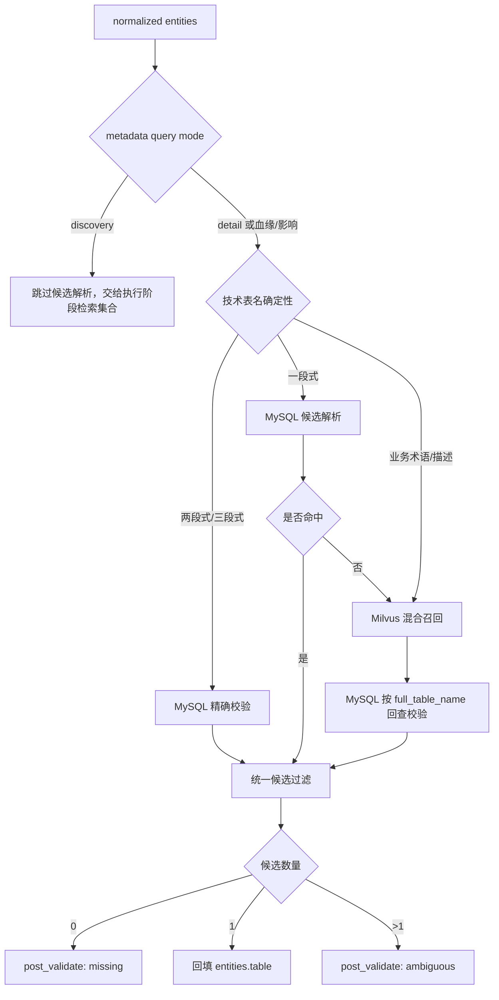

# resolve_metadata_candidates 生产化改造设计

## 1. 目标与边界

本次改造聚焦需要唯一目标表的资产定位。`resolve_metadata_candidates` 的职责是把用户问题中的技术表名、业务术语或业务描述转换为经过事实源校验的候选表，不负责执行血缘查询，也不负责生成最终答案。

元数据查询先由 `determine_metadata_query_mode` 分类：

- `discovery`：用户期望得到一批表，例如“支付相关表有哪些”。Planner 跳过候选查询，由执行阶段运行 `filter_tables + semantic_search + merge_and_rank`，多结果不澄清。
- `detail`：用户要读取某张表的详情，例如“dwd.orderInfo 的表说明和负责人”。Planner 必须先解析唯一表，多候选进入澄清，随后执行 `get_table_detail`。
- `lineage_search/impact_analysis`：天然要求唯一入口表，始终进入候选解析。

核心原则：

- MySQL/TiDB `meta_table` 是表资产事实源，决定表是否真实存在及其权威画像。
- `meta_table_ext` 是结构化业务术语映射，适合确定性词典查询。
- Milvus 是弱语义候选召回器，解决“广告投放转化率”无法直接匹配物理表名的问题。
- Milvus 召回结果必须回 MySQL/TiDB 校验，未经校验不得进入 Neo4j 血缘工具。

## 2. 确定性路由

| 用户线索 | 确定性 | 首选路径 | Milvus 策略 |
| --- | --- | --- | --- |
| `catalog.db.table` | 高 | MySQL 精确查询 | 跳过 |
| `db.table` | 高 | MySQL 精确查询 | 跳过 |
| `table` | 中 | MySQL 按 table_name 查候选并用域/分层过滤 | MySQL 无结果时补召回 |
| “订单信息表” | 中 | `meta_table_ext` 术语映射 | 同时补充语义召回 |
| “广告投放转化率相关表” | 低 | Milvus Dense + BM25 + 标量过滤 | 主召回路径 |



## 3. Milvus Collection Schema

Collection：`data_agent_table_assets_v1`

| 字段 | 类型 | 用途 |
| --- | --- | --- |
| `asset_key` | VARCHAR PK | 稳定资产键，建议使用平台 + full table name |
| `table_id` | INT64 | 对应 MySQL `meta_table.id` |
| `full_table_name` | VARCHAR | 回查事实源和展示候选 |
| `catalog_name` | VARCHAR | catalog 标量过滤 |
| `db_name` | VARCHAR | schema/database 标量过滤 |
| `table_name` | VARCHAR | 物理表名 |
| `biz_line` | VARCHAR | 业务线标量过滤 |
| `domain` | VARCHAR | 主题域标量过滤 |
| `data_layer` | VARCHAR | ODS/DWD/DWS/ADS/DIM 标量过滤 |
| `lifecycle_status` | VARCHAR | 只召回 online 资产 |
| `searchable_text` | VARCHAR | 表名、表注释、业务术语、标签、指标描述拼接文本 |
| `dense_vector` | FLOAT_VECTOR(1024) | 中文语义召回，维度由 embedding 模型决定 |
| `sparse_vector` | SPARSE_FLOAT_VECTOR | Milvus BM25 Function 自动生成 |
| `source_updated_at` | INT64 | 增量同步和新鲜度判断 |
| `metadata` | JSON | owner、标签、热度等非核心扩展信息 |

索引策略：

- `dense_vector`：`AUTOINDEX + COSINE`。
- `sparse_vector`：`SPARSE_INVERTED_INDEX + BM25`，使用 `DAAT_MAXSCORE`。
- `biz_line/domain/data_layer/lifecycle_status`：倒排索引，用于 ANN 前标量过滤。
- 中文 BM25：`searchable_text` 使用 Jieba analyzer。

`searchable_text` 示例：

```text
dwd.ad_campaign_conversion 广告投放转化明细表 营销域 DWD
统计广告曝光、点击、激活、授信和转化率，支持渠道和活动效果分析
业务术语: 广告投放 转化率 渠道效果 营销转化
```

## 4. 混合检索与事实校验

Milvus 同时发起两路召回：

- Dense：理解“广告投放转化率”和“营销渠道效果”等语义近似关系。
- BM25：保留表名、业务术语和关键字的精确匹配能力。

两路结果使用 RRF 融合。`biz_line/domain/data_layer/lifecycle_status` 在检索阶段作为标量过滤条件，减少跨域误召回。Embedding 服务未配置或临时失败时，代码降级为 BM25；Milvus 整体不可用时保留结构化 MySQL 结果并在 notes 中记录原因。

Milvus 命中的 `full_table_name` 会调用 `MySQLMetadataRepository.find_by_full_table_names()` 回查：

- 不存在或已下线：丢弃。
- 存在：补齐权威 domain、data_layer、biz_line、owner 等画像。
- 唯一：回填 `entities.table`。
- 多个：交给 `post_validate_slots` 触发澄清，不静默选择。

候选解析会同时写入 `MetadataCandidateEvidence`，记录：

- `source`：MySQL 技术表名、MySQL 业务术语、Milvus + MySQL 校验或 mock fallback。
- `validation_status`：`validated`、`unverified`、`fallback`。
- `score/rank/score_gap_to_next/retrieval_mode`：语义召回的质量证据。

血缘和影响分析只允许 `validated` 候选继续执行。唯一候选会统一回填为 `db.table`，避免 Neo4j 收到一段式别名。Milvus 自动选择阈值通过以下环境变量配置：

```bash
export DATA_AGENT_MILVUS_MIN_SCORE="0"
export DATA_AGENT_MILVUS_MIN_SCORE_GAP="0"
```

不同检索模式的分数尺度不同，生产值必须通过离线标注集标定；默认 `0` 表示先记录证据但不启用数值阻断。

## 5. 部署与配置

本项目复用本机已有镜像，但使用独立容器和 Docker named volumes：

```bash
docker compose -f docker-compose.milvus.yml up -d
conda run -n python-agent python -m data_agent.infrastructure.repositories.milvus_schema
```

服务地址：

- Milvus SDK：`http://127.0.0.1:19531`
- Milvus WebUI：`http://127.0.0.1:9092/webui/`

LM Studio Embedding 配置：

```bash
export DATA_AGENT_EMBEDDING_BASE_URL="http://127.0.0.1:1234/v1"
export DATA_AGENT_EMBEDDING_API_KEY="lm-studio"
export DATA_AGENT_EMBEDDING_MODEL="LM Studio 中加载的 embedding 模型 ID"
export DATA_AGENT_EMBEDDING_DIM="1024"
```

Collection 的向量维度必须与模型输出完全一致。更换 embedding 模型或维度时应新建带版本号的 Collection，并通过 alias 灰度切换，不能原地混写不同模型向量。

## 6. 后续数据同步

本次完成 Collection、查询 Repository 和 Planner 路由。下一步需要实现 MySQL 到 Milvus 的 CDC/批量同步：

1. 从 `meta_table` 获取物理资产和权威标量字段。
2. 从 `meta_table_ext`、术语平台、标签平台和指标平台聚合业务描述。
3. 生成 `searchable_text` 和 dense embedding。
4. 以 `asset_key` 幂等 upsert Milvus。
5. 使用 `source_updated_at` 做增量更新，并对下线资产 delete/标记 offline。
6. 建立召回率、候选准确率、零结果率、事实校验淘汰率和延迟监控。
